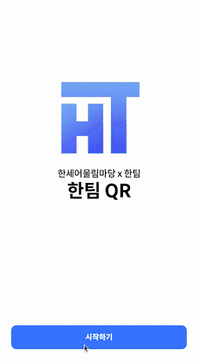
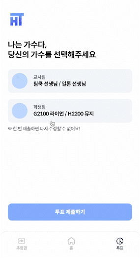
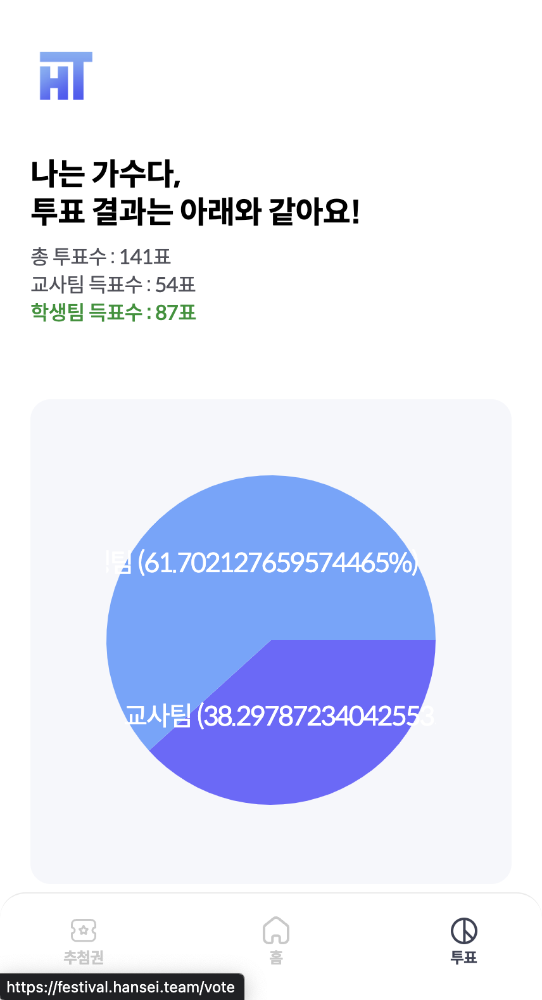

# 한팀 QR

2022 한세어울림마당 축제 서비스

## 프로젝트 소개

> 한세어울림마당이라는 교내 축제를 위해 학생회의 요청으로 만들어진 서비스에요  
> 코로나 이후, 첫 축제로 학생회 친구들이 열심히 준비한 축제였기에, 비록 짧은 시간이라도 열심히 만들었답니다  
> 축제의 꽃 🌼, 공연에 사용할 여러 기능들을 위주로 이루어져 있어요 !  
> 짧은 시간에 급하게 만들었지만, 다행히 아무런 이슈 없이 성공적으로 마무리할 수 있었어요

## 프로젝트 기술 스택

## 주요 기능 및 페이지 소개

### 스플래시

> 사용자가 처음으로 서비스에 접속하면 뜨는 스플래시 화면이에요  
> 이미 로그인한 사용자라면, 시작하기 버튼 클릭 시, 홈 화면으로 이동되어요

---

### 로그인

> Firebase를 이용해 구현한 전화번호 인증 로그인 기능이에요  
> 공연을 진행하는 체육관 입장과 동시에 사용자들이 로그인해야되는 상황이었기에  
> 소셜로그인보다 간편한 전화번호 인증 로그인을 채택했어요

---

### 경품 번호 추첨

> 번호를 추첨하고 학생/선생님들께 경품을 추첨하는 코너가 있었어요  
> 따라서 사용자가 처음 로그인하는 동시에 겹치지 않는 고유한 번호를 추첨해서 볼 수 있도록 구현했답니다
>
> 아래 화면에 보이는 상품들의 이름은 모두 숨김 처리되어 있었어요  
> (~~사회자의 상품 공개에 맞춰 일일이 수동으로 변경했어요 :)~~)

---

### 나는가수다 투표

> 한세사이버"보안"고등학교답게 투표 시간은 Base64로 인코딩해서 공개했어요 😝  
> 혹시나 Base64를 모르는 분들도 있을 수도 있기에, 아래에서 볼 수 있도록 Base64 디코더 사이트로 리다이렉트했어요  
> (~~이 기능도 마찬가지로 사회자의 안내에 맞춰서 수동으로 변경했답니다~~)
>
> Firebase의 Realtime Database를 이용해 DB 설정 값에 따라 스크린이 바로 변경될 수 있도록 구현했어요  
> 따라서 개발자인 제가 투표를 비활성화하거나, 투표 선택지 데이터를 변경한다면 실시간으로 반영되어요  
> 그리고 투표가 종료된 후에는, 데이터를 원형 차트로 시각화하여 사용자들이 결과를 볼 수 있도록 했어요

|                     투표 공개 전                     |                     투표 진행 중                     |                    투표 결과 공개                    |
| :--------------------------------------------------: | :--------------------------------------------------: | :--------------------------------------------------: |
|  |  |  |
